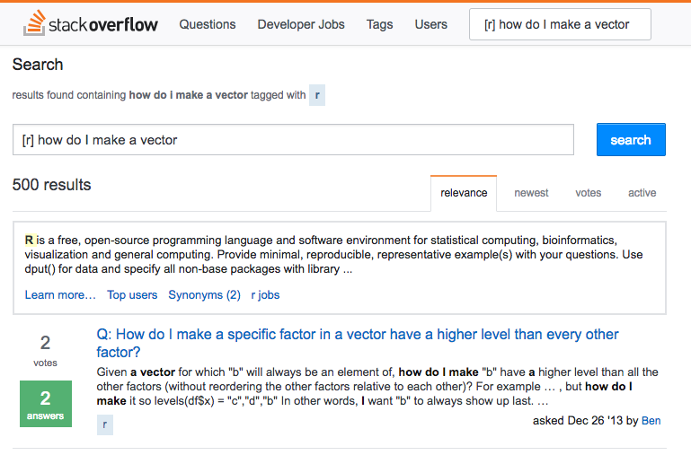

# Basics {#basics}

## Operating R Studio

- There are a few ways you can use R Studio: 

1. **Command line/Console**: writing each command by itself and copying down the result as needed
    - Great for testing individual commands to see what happens
    - Not reproducible! Not saved! NOT RECOMMENDED!
2. **.R files**: A sequence of commands (and hopefully comments) saved as a script, the entire script is run all at once
    - Can test individual commands in command line and then put good commands in *.R* file 
    - Equivalent to a *.do* file for Stata
    - Reproducible, saved, commented

3. **R Markdown (*.Rmd*) files**: A plain text document written in *R Markdown* language
    - Allows for individual chunks of *R* code to be run individually (great for testing one command instead of all at once)
    - Reproducible, saved, commented as if a normal document 
    - Can write an entire document (text, equations, R commands, figures, tables, etc) with one file! 
    - Can export to html, MS Word, Beamer, etc!
    - Markdown is a language that is intuitive, simple, human- and machine-readable


### Keyboard Shortcuts
  - `Ctrl+2`: move cursor to console
  - `Ctrl` (`Cmd` on Mac)`+Enter`: run current line (from editor) in console
  - `Ctrl` (`Cmd` on Mac)`+Enter`
  - `Uparrow`: retrieve recent commands in console
  - `Ctrl` (`Cmd` on Mac)`+Uparrow`: search previous commands
  - `Option -`: insert assignment operator (`<-`) 
  - `Ctrl` (`Cmd` on Mac)+`Shift+M`: insert pipe operator (`%>%`)
  
## Working Directory (`wd`){#Working-directory}
- *R* assumes a default (often inconvenient) working directory on your computer
    - this is where it thinks it will **load** any files you want to load and **save** anything you want to save by default
- Find out where *R* currently thinks this is with **`getwd()`**
    - this is often Operating System specific, e.g.: 
        - Mac: `/Users/yourusername/`
        - Windows: `C:/Users/yourusername/Documents/`
    - you can move everything you want to load into this folder on your computer (and save everything there too), but this may be inconvenient 
- *Change* the working directory to wherever you plan on keeping your related data and documents with **`setwd("/path/to/folder")`**
    - you can move to a new `wd` *relative* to the current working directory: 
        - move down a folder by typing the folder name with a `/` after i
            - e.g. to move from `/Ryansafner/Documents/` to `/Ryansafner/Documents/Econometrics/`
        - move up one folder in a hierarchy with `..`
           - e.g. to move from `/Ryansafner/Documents/` to `/Ryansafner/Downloads`, use `setwd("../Downloads/")` to move up from the `Documents` folder to `Ryansafner` folder, then down to Downloads

## Packages

- **Packages** are extensions of base `R` designed by users 
    - Remember, `R` is open source, packages are usually published first on [Github](github.com)
    - Official packages distributed and documented through [CRAN](cran.r-project.org/) 
- To use a (previously-installed) package (note the ""), use the `library()` command:  
```
library("packagename")
```
- If you do not have a package, they are easy to install with (note the plural "s")
```
install.packages("packagename")
```
- To install or load multiple packages at once, we can use the `c()` function to select multiple packages (**see below**)

```
library(c("gapminder","ggplot2","dplyr"))
```

## Useful Packages

- There are several packages we will use often (and are featured later in this guide)
    - Packages are often very well-documented with explanations and examples 
    - Google each package for more information
    
\begin{table}
  \begin{tabular}{ll}
  Package name & Use \\ \toprule 
  \texttt{ggplot2} & Rendering beautiful graphics (scatterplots, histograms, etc)\\
  \texttt{stargazer} & Rendering professioanl looking regression output tables\\
  \texttt{dplyr} & Manipulating data much more intuitively\\
  \texttt{sandwich} & More tools for regression, particularly robust SE's\\
  \texttt{tidyverse} & An epic \emph{meta}package of \texttt{ggplot2, dplyr} and other popular packages\\ \bottomrule
  \end{tabular}
\end{table}

## Calculations

- `R` can be used as a calculator 
    - Basic operations `+`, `-`, `*`, `/`
    - More advanced math operators like exponents, logarithms, trigonometric functions, etc

```{r}
2+2
6^2 # 6 to the second power (i.e. squared)
sqrt(100/4) # square root 
log(5) # logarithm
sin(2*pi) # sin
factorial(5) # factorial (e.g. 5!)
choose(2,6) # binomial choose function

# order of operations matters
3*3+4
3*(3+4)
```

- **Note on Notation**: `R` often reports very large (or very small) numbers in scientific notation with `e`
    - For positive `e`: the number of zeros (or digits after the decimal point) to the right of a number 
        - e.g. $1.25e6 = 1.25 \times 10^6 = 1,250,000$
    - For negative `e`: one less than the number of zeros (or digits after the decimal point) to the left of a number 
        - e.g. $1.25e-6 = 1.25 \times 10^{-6} = 0.00000125$
        
## Hints for Writing Code

### Naming Objects 

- Object names cannot start with a digit or contain a space or comma
- FOR THE LOVE OF GOD AVOID SPACES IN GENERAL
    - You've seen webpages intended to be called `"my webpage in html"` turned into `http://my%20webpage%20in%20html.html`
    - Consider both your `R` objects and your files and folder names on your computer...(`/School/ECON_480_Econometrics/Homeworks_and_Data/`)
- It will be wise to adopt some consistent standard for demarcating names:
```
i.use.snake.case
otherPeopleUseCamelCase
some_people_use_underscores
And_aFew.People_RENOUNCEconvention
```

### Commenting

- Always comment your commands! Describe what you are doing so someone else (or you, 5 years later) can understand what is happening and why! 
    - Use the hashtag `#` to start a comment (`R` ignores everything on that line after the hashtag)
    - Can be made its own line or at the end of lines
    - e.g.
```{r writing, eval=FALSE}
# Run regression of y on x, save as reg1
reg1<-lm(y~x, data=mydata) # runs regression using mydata 
summary(reg1$coefficients) # prints coefficients
```

### Managing Your Workflow

- **Save often!**
    - Better yet, ask me about version control and GitHub

## Getting Help

- You can get documentation, explanations, and examples of every command in `R` 
    - simply type `?commandname` or `help("commandname")`
- Meet your new friend: 


- Meet your new *best* friend:



- The **only** way to learn coding is by tweaking existing examples, messing up, and searching the internet for help! 
